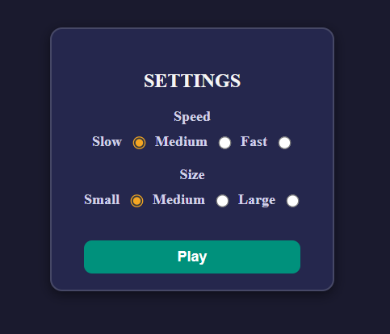
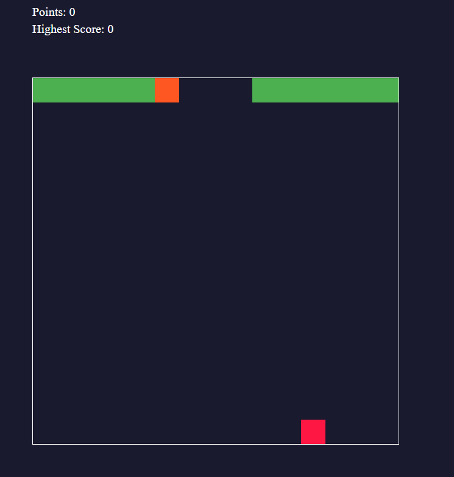

# 🐍 Classic Snake Game  

A **JavaScript-based** implementation of the classic **Snake Game**, featuring **smooth controls, responsive movement, and dynamic gameplay**. Unlike traditional versions, the **edges do not end the game**—instead, the challenge lies in avoiding self-collisions.  

## 🚀 Live Demo

You can check out the live version of this project here:  
👉 [Live Demo](https://snake-game-tau-navy.vercel.app/)

## 🎮 Features  

- **Smooth & Responsive Controls** – Enjoy fluid movement for an optimal gaming experience.  
- **Edge Wrapping Mechanics** – The snake **doesn’t die at the edges**, adding a unique twist.  
- **Customizable Difficulty** – Adjust the **snake’s speed and size** to match your skill level.  
- **High Score Tracking** – Challenge yourself to **beat your previous best**.  

## 🚀 Technologies Used  

- **JavaScript** – Core game logic and interactivity.  
- **HTML & CSS** – Game layout and styling.  

## 📸 Screenshots  

### Main Menu  


### Gameplay  
  

## 🛠️ Installation & Setup  

1. Clone the repository:  
   ```bash
   git clone https://github.com/vladig98/SnakeGame.git
   cd SnakeGame
   ```  
2. Open `index.html` in a browser to play the game.  

## 🏆 How to Play  

- Use the **arrow keys (⬆️⬇️⬅️➡️)** to control the snake.  
- **Eat food** to grow longer and increase your score.  
- **Avoid colliding with your own body**—hitting yourself **ends the game**!  
- **Customize difficulty** in the settings to change speed and snake size.  

## 🐍 Contributing  

Contributions are welcome! Feel free to **fork** the repository, create a **new branch**, and submit a **pull request**.  

## 📄 License  

This project is licensed under the **MIT License**.  

---

**🎮 Ready to test your reflexes? Play now and set a new high score! 🚀**  
